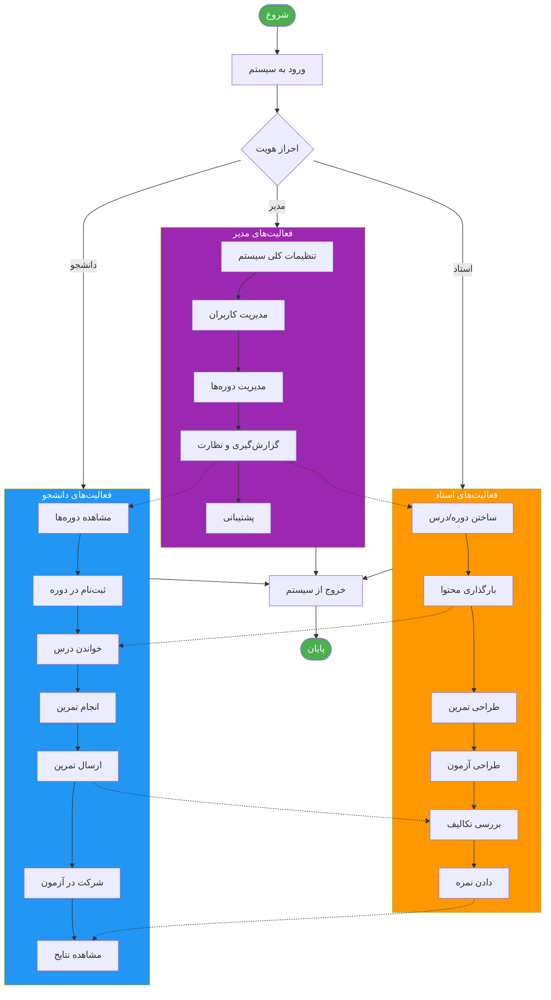

```mermaid
flowchart TD
    Start([شروع]) --> Login[ورود به سیستم]
    Login --> Auth{احراز هویت}
    
    Auth -->|مدیر| Admin
    Auth -->|استاد| Teacher
    Auth -->|دانشجو| Student
    
    subgraph Admin [فعالیت‌های مدیر]
        A1[تنظیمات کلی سیستم] --> A2[مدیریت کاربران]
        A2 --> A3[مدیریت دوره‌ها]
        A3 --> A4[گزارش‌گیری و نظارت]
        A4 --> A5[پشتیبانی]
    end
    
    subgraph Teacher [فعالیت‌های استاد]
        T1[ساختن دوره/درس] --> T2[بارگذاری محتوا]
        T2 --> T3[طراحی تمرین]
        T3 --> T4[طراحی آزمون]
        T4 --> T5[بررسی تکالیف]
        T5 --> T6[دادن نمره]
    end
    
    subgraph Student [فعالیت‌های دانشجو]
        S1[مشاهده دوره‌ها] --> S2[ثبت‌نام در دوره]
        S2 --> S3[خواندن درس]
        S3 --> S4[انجام تمرین]
        S4 --> S5[ارسال تمرین]
        S5 --> S6[شرکت در آزمون]
        S6 --> S7[مشاهده نتایج]
    end
    
    %% ارتباط بین فعالیت‌ها
    T2 -.-> S3
    S5 -.-> T5
    T6 -.-> S7
    A4 -.-> T1
    A4 -.-> S1
    
    Admin --> Logout
    Teacher --> Logout
    Student --> Logout
    
    Logout[خروج از سیستم] --> End([پایان])
    
    %% استایل‌ها
    classDef admin fill:#9C27B0,color:white
    classDef teacher fill:#FF9800,color:white
    classDef student fill:#2196F3,color:white
    classDef startEnd fill:#4CAF50,color:white
    
    class Admin,Admin* admin
    class Teacher,Teacher* teacher
    class Student,Student* student
    class Start,End startEnd
```
