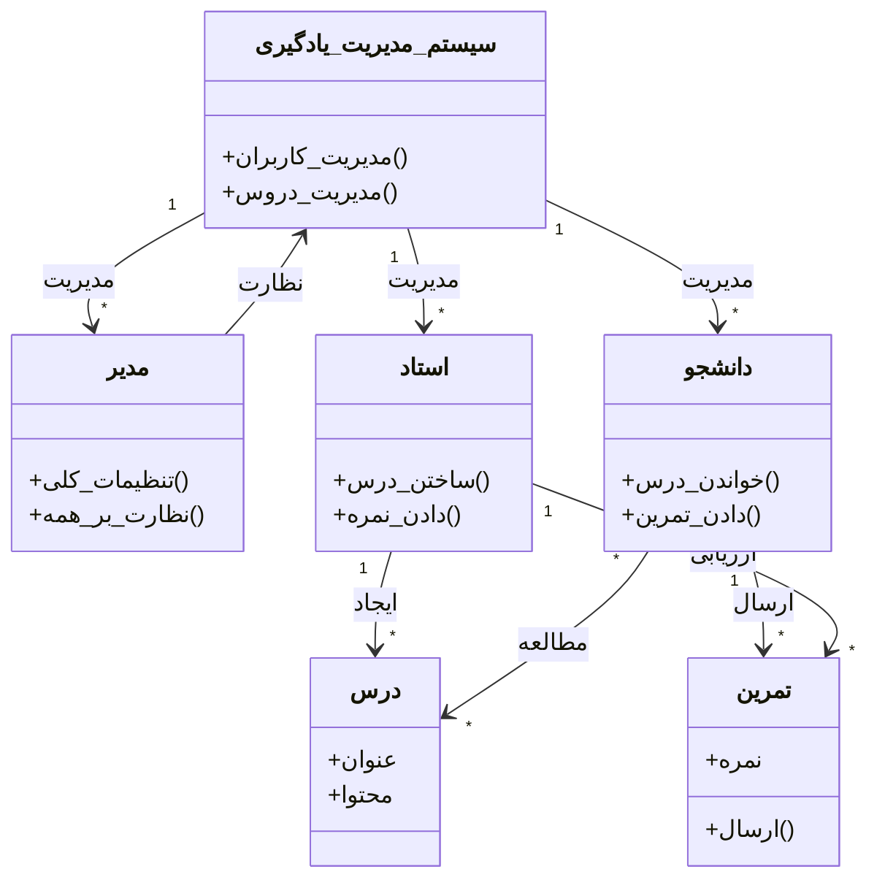

```mermaid
classDiagram
    class سیستم_مدیریت_یادگیری {
        +مدیریت_کاربران()
        +مدیریت_دروس()
    }

    class مدیر {
        +تنظیمات_کلی()
        +نظارت_بر_همه()
    }

    class استاد {
        +ساختن_درس()
        +دادن_نمره()
    }

    class دانشجو {
        +خواندن_درس()
        +دادن_تمرین()
    }

    class درس {
        +عنوان
        +محتوا
    }

    class تمرین {
        +ارسال()
        +نمره
    }

    %% روابط
    سیستم_مدیریت_یادگیری "1" --> "*" مدیر : مدیریت
    سیستم_مدیریت_یادگیری "1" --> "*" استاد : مدیریت
    سیستم_مدیریت_یادگیری "1" --> "*" دانشجو : مدیریت

    استاد "1" --> "*" درس : ایجاد
    دانشجو "*" --> "*" درس : مطالعه
    دانشجو "1" --> "*" تمرین : ارسال
    استاد "1" --> "*" تمرین : ارزیابی
    مدیر --> سیستم_مدیریت_یادگیری : نظارت

```
