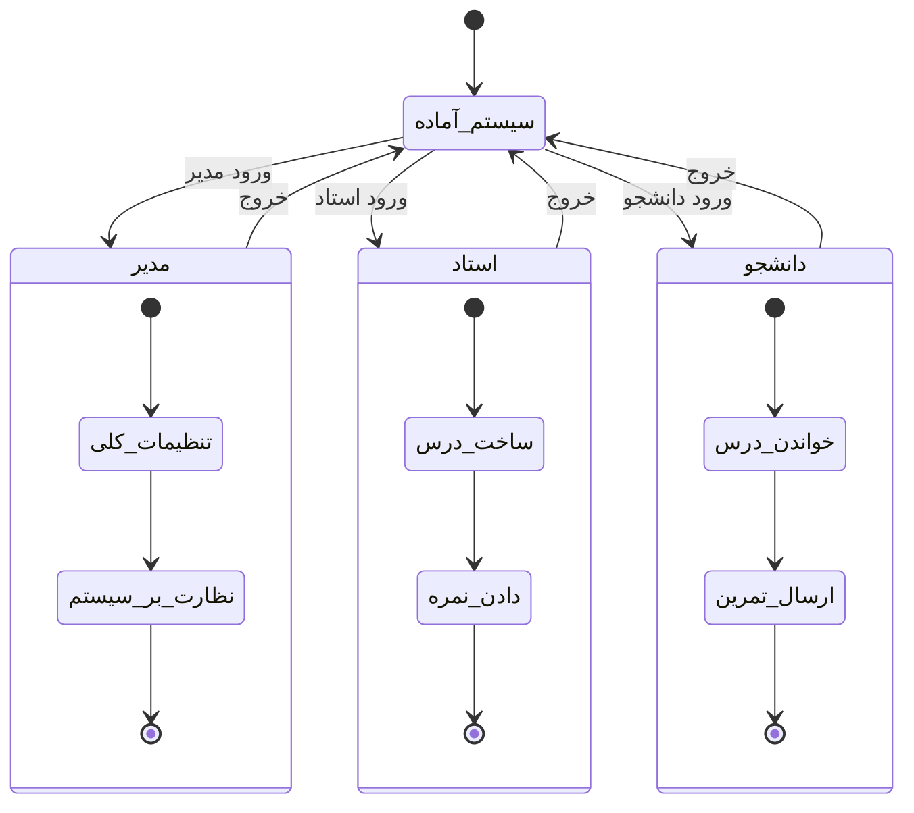

```mermaid
stateDiagram-v2
    [*] --> سیستم_آماده

    سیستم_آماده --> مدیر : ورود مدیر
    سیستم_آماده --> استاد : ورود استاد
    سیستم_آماده --> دانشجو : ورود دانشجو

    %% مدیر
    state مدیر {
        [*] --> تنظیمات_کلی
        تنظیمات_کلی --> نظارت_بر_سیستم
        نظارت_بر_سیستم --> [*]
    }

    %% استاد
    state استاد {
        [*] --> ساخت_درس
        ساخت_درس --> دادن_نمره
        دادن_نمره --> [*]
    }

    %% دانشجو
    state دانشجو {
        [*] --> خواندن_درس
        خواندن_درس --> ارسال_تمرین
        ارسال_تمرین --> [*]
    }

    مدیر --> سیستم_آماده : خروج
    استاد --> سیستم_آماده : خروج
    دانشجو --> سیستم_آماده : خروج


```
