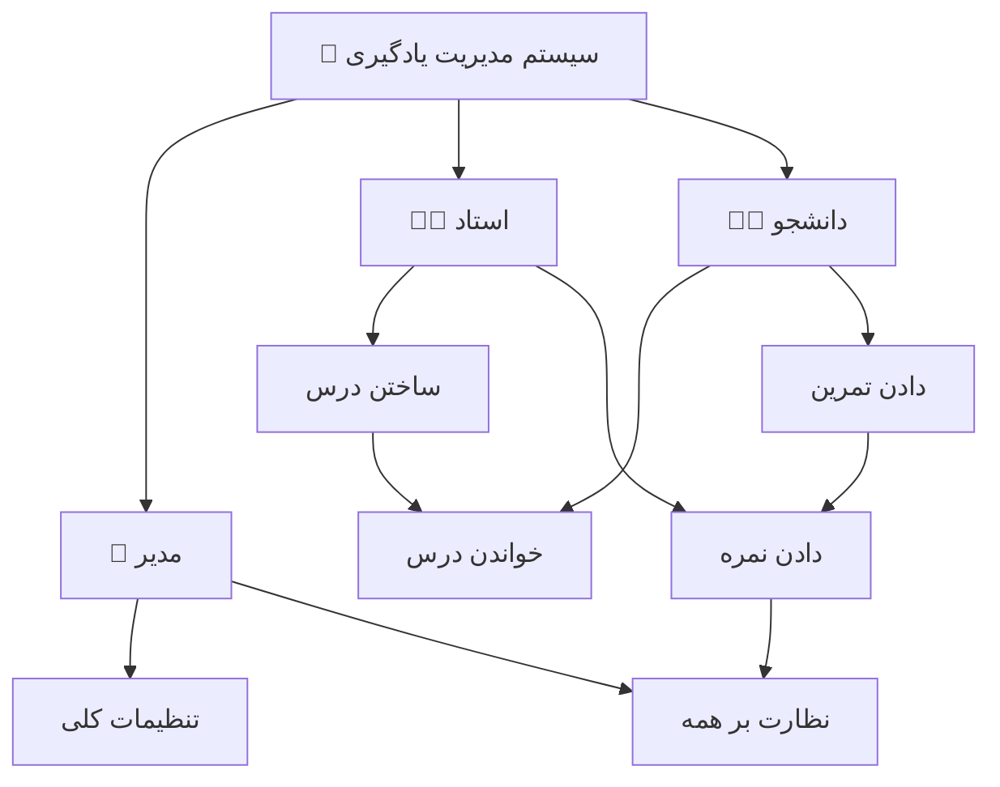

```mermaid
flowchart TD
    A[🏫 سیستم مدیریت یادگیری] --> B[👑 مدیر]
    A --> C[👨‍🏫 استاد]
    A --> D[👨‍🎓 دانشجو]
    
    B --> B1[تنظیمات کلی]
    B --> B2[نظارت بر همه]
    
    C --> C1[ساختن درس]
    C --> C2[دادن نمره]
    
    D --> D1[خواندن درس]
    D --> D2[دادن تمرین]
    
    C1 --> D1
    D2 --> C2
    C2 --> B2
    
```