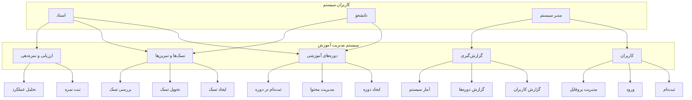

```mermaid
graph TB
    subgraph سیستم مدیریت آموزش
        A[کاربران]
        B[دوره‌های آموزشی]
        C[تسک‌ها و تمرین‌ها]
        D[ارزیابی و نمره‌دهی]
        E[گزارش‌گیری]
    end

    subgraph کاربران سیستم
        U1[ استاد]
        U2[ دانشجو]
        U3[ مدیر سیستم]
    end

    U1 --> B
    U1 --> C
    U1 --> D
    
    U2 --> B
    U2 --> C
    
    U3 --> A
    U3 --> E

    A --> A1[ثبت‌نام]
    A --> A2[ورود]
    A --> A3[مدیریت پروفایل]
    
    B --> B1[ایجاد دوره]
    B --> B2[مدیریت محتوا]
    B --> B3[ثبت‌نام در دوره]
    
    C --> C1[ایجاد تسک]
    C --> C2[تحویل تسک]
    C --> C3[بررسی تسک]
    
    D --> D1[ثبت نمره]
    D --> D2[تحلیل عملکرد]
    
    E --> E1[گزارش کاربران]
    E --> E2[گزارش دوره‌ها]
    E --> E3[آمار سیستم]
```